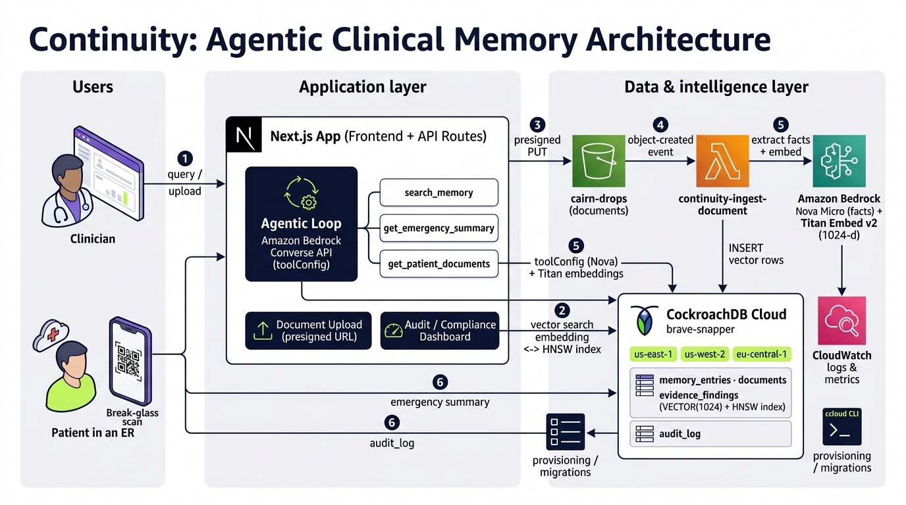

## Inspiration

Healthcare is the only industry where "the system was down" can directly cost lives. When a patient arrives at an ER unconscious, with no history, no allergy list, and no medication record, clinicians make decisions with incomplete information. The average medical error rate in emergency settings is alarmingly high, and a significant portion traces back to fragmented patient memory across systems.

We asked: what if an AI agent could remember *every* patient interaction, not just today's visit but the full longitudinal record, and make that memory available globally, instantly, even in an emergency? Not a chatbot that summarizes notes, but a persistent, agentic memory layer that lives in a distributed database, survives region failures, and speaks the same language as production infrastructure.

Continuity is that agent. It stores, retrieves, and reasons over patient memory using CockroachDB as its persistent backbone, with Amazon Bedrock models powering the intelligence. The name says everything: in healthcare, continuity of memory *is* continuity of care.

---

## What it does

Continuity turns fragmented health records into a persistent, agentic memory layer. In a chat interface, clinicians ask questions, and the agent reasons over that memory using a Bedrock-powered tool-call loop — deciding which tools to invoke, executing them against CockroachDB, and synthesizing a sourced answer.

**1. Agentic Memory Retrieval.** A clinician asks "Show me Lucas's key medical history and all active allergies." The agent doesn't just search a database — it reasons. Using a Bedrock-powered tool-call loop, it decides which tools to invoke (memory search, emergency summary, document lookup), executes them against CockroachDB, synthesizes the results, and returns a structured answer with sourced facts and confidence scores.

**2. Document Ingestion Pipeline.** Clinicians upload clinical documents (charts, notes, labs) directly to S3 via presigned URLs. An S3-triggered Lambda reads the document, sends it to Bedrock Nova Micro for medical fact extraction, embeds each fact via Bedrock Titan, and stores the structured memory entries in CockroachDB with HNSW vector indexes. The pipeline is fully serverless and event-driven.

**3. Emergency Break-Glass Access.** For situations where a patient can't provide history, the system generates signed, 60-minute capability URLs with QR codes. An ER clinician scans the code, enters a reason code (mandatory for audit), and gets immediate access to the emergency summary: allergies, medications, conditions, emergency contacts. Every access is logged to a global audit trail. Links can be revoked before expiry.

**4. Multi-Region Memory.** The patient record lives across three CockroachDB regions (us-east-1, us-west-2, eu-central-1). When a patient arrives at an ER on a different continent, the agent reads from a memory that was written hours ago on another continent, with zero data loss and no manual replication.

**5. Compliance Dashboard.** Every memory access, agent query, document upload, and break-glass event is recorded in an audit log. The compliance view shows access success rates, denied requests, and a full event timeline with actor attribution, region, and reason codes.

---

## How we built it

The architecture layers CockroachDB's distributed SQL and vector capabilities under an agentic Bedrock-powered application. Here's the full stack:

### The Memory Layer (CockroachDB)

The `memory_entries` table stores extracted medical facts with a `VECTOR(1024)` column, HNSW-indexed for approximate nearest-neighbor search. This is the core of the agent's retrieval: when a clinician asks a question, the query is embedded via Bedrock Titan and searched against this index using CockroachDB's `<->` vector distance operator.

The `documents` table tracks source documents with their own embeddings. The `emergency_summary` table holds the critical-care snapshot. The `audit_log` table records every access event with timestamp, actor, action, region, and outcome. All tables use CockroachDB's multi-region features with `home_region` columns for data locality.

The PostgreSQL wire protocol means standard `pg` drivers work natively; no custom connector needed. The Lambda connects directly via `pg.Pool` with SSL.

### The Agent Loop (Bedrock + CockroachDB)

The agent uses Bedrock's Converse API with Nova Micro in a tool-call loop (max 3 steps). Three tools are registered:

- **`search_memory`.** Hybrid retrieval: Titan embeds the query, vector search runs against CockroachDB's HNSW index, and if no vector hits, falls back to keyword search with tokenized `LIKE` queries. Returns facts with category, confidence, and source attribution.
- **`get_emergency_summary`.** Reads the emergency summary from CockroachDB for urgent care context.
- **`get_patient_documents`.** Lists uploaded source documents with extracted text snippets.

The loop injects initial memory context before the first tool call, so the model has grounding even before it decides which tools to invoke.

### The Ingestion Pipeline (S3 + Lambda + Bedrock + CockroachDB)

1. Browser uploads directly to S3 via a presigned URL (no server-side proxy)
2. S3 event triggers the Lambda (`continuity-ingest-document`)
3. Lambda reads the document, sends text to Nova Micro with a medical fact extraction prompt
4. Nova returns a JSON array of categorized facts (allergy, medication, condition, etc.)
5. Each fact is embedded via Titan and inserted into `memory_entries` with its vector
6. The document's own text is embedded and stored in the `documents` table

The Lambda uses CloudWatch for observability. The entire pipeline is serverless; no containers to manage.

### The Emergency System (CockroachDB + Auth + HMAC)

The break-glass system has two paths: a direct API call (for clinicians in the app) and signed capability URLs (for external devices). The signed tokens use HMAC-SHA256 with a 60-minute TTL, and can be revoked before expiry. Every break-glass access requires a reason code and creates both an `emergency_access_events` row in CockroachDB and an `audit_log` entry. The `/e` public portal verifies tokens and checks revocation status before granting access.

### The Frontend (Next.js 15)

The dashboard renders real-time counts from CockroachDB via the overview API. The agent chat returns structured widget cards (patient profile, memory hits with confidence bars, allergies, medications, sources) rendered inline with the conversation. The documents page shows upload status, file types, and ingestion progress. The compliance page displays the full audit trail.

---

## Meaningful integration of CockroachDB and AWS

CockroachDB is the agent's memory layer, not a bolt-on. Every agent action reads from or writes to the same PostgreSQL-compatible cluster, and the CockroachDB tools we selected are load-bearing: the agent cannot answer a question without them. We used **3 of the 4 required CockroachDB tools** plus four AWS services.

### CockroachDB Distributed Vector Indexing (the retrieval core)

This is the heart of the agent. Memory is stored in `memory_entries`, `documents`, and `evidence_findings`, each with a `VECTOR(1024)` column backed by an **HNSW index** (`vector_l2_ops`) created via `ccloud sql`. When a clinician asks a question:

1. The query is embedded by Amazon Titan into a 1024-dimensional vector.
2. The agent runs `SELECT ... ORDER BY embedding <-> $2::vector` against the HNSW index (`lib/continuity.ts`).
3. Semantically ranked facts come back with category, confidence, and source attribution.

This is the path every chat message, emergency summary, and document lookup flows through. Embeddings are written at ingest time by the Lambda and backfilled for legacy rows by `scripts/backfill-embeddings.mjs`, so vector data and operational data live in the same table, with zero consistency gap and no separate vector store to maintain.

### ccloud CLI (the control plane)

The agent-ready ccloud CLI provisions and operates the whole environment from the terminal, with JSON output and service-account RBAC:
- Cluster provisioning and multi-region configuration of `brave-snapper` (us-east-1, us-west-2, eu-central-1).
- Schema and migration execution, including creating the HNSW vector indexes (`CREATE INDEX ... USING hnsw ... vector_l2_ops`), via `ccloud sql`.
- Connection string management and backup oversight.

So the ccloud CLI is how the cluster was provisioned and how the vector indexes were actually created, not a one-line mention.

### Cloud Managed MCP Server (operator + agent gateway)

We connect tooling to `brave-snapper` through the Cloud Console's managed MCP Server, running in read-only mode with full audit logging, so a judge can point an MCP-compatible agent (Claude, Cursor, VS Code) at the cluster with the single config snippet and inspect the live schema, tables, and memory rows. Safe by default and zero custom proxy.

### Amazon Bedrock (reasoning + embeddings)

Two Bedrock models drive the agent:
- **amazon.nova-micro-v1:0** via the Converse API (`toolConfig`) runs the agentic tool-call loop: it reads the question, decides which CockroachDB tools to call (`search_memory`, `get_emergency_summary`, `get_patient_documents`), and synthesizes sourced answers. It also extracts structured medical facts from uploaded documents.
- **amazon.titan-embed-text-v2:0** produces the 1024-d embeddings that feed the HNSW index in both the ingest Lambda and the retrieval path.

The model only ever answers from what the CockroachDB tools return, so every claim traces back to a stored fact.

### AWS Lambda + S3 + CloudWatch (serverless ingestion)

Clinicians upload charts and notes directly to S3 (`cairn-drops`) via presigned URLs (`lib/s3.ts`). An S3 object-created event triggers the `continuity-ingest-document` Lambda (`lambdas/ingest-document`), which reads the document, has Nova extract structured facts, embeds each fact with Titan, and inserts vector rows into `memory_entries` plus a `documents` row. CloudWatch provides logs and metrics for every invoke.

The pipeline is genuinely event-driven, no polling or schedules: storage (S3), compute (Lambda), and intelligence (Bedrock) converge on one write to the CockroachDB memory layer, which the agent can immediately retrieve through the vector index.

---

## Challenges we ran into

**1. Vector search fallback design.** HNSW indexes require embeddings to exist, but what about facts inserted before Bedrock was configured, or when the embedding model is temporarily unavailable? We built a hybrid retrieval path: vector search first, keyword fallback with tokenized `LIKE` queries and stemming (handling plurals, "ies" → "y") when vectors are missing. This means the agent degrades gracefully instead of returning empty results.

**2. Self-fetch race in RSC.** Next.js server components that fetch their own API routes (`/api/overview`) can fail during dev hot-reload when the server is mid-compile. The self-fetch hits the same busy process, causing RSC streaming errors. Fixed by switching to same-origin relative fetches with try/catch fallback, so the dashboard now degrades to seed data on transient failures instead of crashing.

**3. Bedrock tool-use schema friction.** The Bedrock Converse API's tool input schemas use a `json` union type that doesn't map cleanly to TypeScript. The `chatWithTools` function needed explicit type assertions (`as never`) to satisfy the TypeScript compiler while preserving runtime correctness.

**4. Emergency link persistence across environments.** On localhost, break-glass links are stateless HMAC tokens, which is fine for dev. On deployed environments, revocation requires a persistence layer. We added a conditional storage path: when the request host isn't localhost, links are persisted with token hashes (never raw tokens) and can be revoked before TTL expiry.

---

## Accomplishments that we're proud of

**The agent actually reasons.** It's not a thin wrapper around a language model. The tool-call loop means Nova Micro reads the question, decides which CockroachDB tables to query, executes the tools, and synthesizes results, all in a single request. The initial memory retrieval provides grounding, and the model chooses whether to go deeper.

**Hybrid vector + keyword retrieval.** CockroachDB's HNSW index powers semantic search, but the keyword fallback means the system works even without embeddings. This is production thinking: things break, models go down, and the agent should still return something useful.

**The ingestion pipeline is fully serverless and event-driven.** Upload to S3 → Lambda fires → Nova extracts facts → Titan embeds → CockroachDB stores. No polling, no queues to manage, no containers. CloudWatch handles observability.

**Real audit trail, not decoration.** Every agent query, document upload, and break-glass access creates an audit log entry with actor attribution, region, and outcome. The compliance dashboard shows real data, not hardcoded mockups.

**Emergency access works cross-region.** The break-glass system is designed for the scenario where a patient arrives unconscious in a different country. The agent reads from CockroachDB's multi-region cluster and returns the emergency summary with zero manual intervention.

---

## What we learned

**Agentic memory is fundamentally different from application memory.** Traditional apps read and write rows. Agents spawn autonomously, write constantly, and need memory that persists across regions, failures, and scale, with zero data loss. CockroachDB's distributed SQL model fits this perfectly: the same cluster handles vector embeddings, transactional writes, and cross-region reads without a separate vector store.

**Tool-use changes everything about retrieval.** A chatbot with RAG just retrieves and generates. An agent with tools *decides* what to retrieve, when to go deeper, and when the initial context is enough. The difference is night and day for clinical accuracy: the model can refuse to answer if the memory doesn't support it, rather than hallucinating.

**Graceful degradation is non-negotiable.** The hybrid vector/keyword retrieval, the fallback chat modes when Bedrock is unconfigured, the try/catch around self-fetches, all of these exist because production systems fail in unexpected ways. The agent should degrade, not crash.

---

## What's next for Continuity

**Consent-aware memory filtering.** The schema already has `consent_grants` and `consent_state` columns. The next step is making the agent's retrieval respect consent boundaries: if a patient hasn't consented to share mental health records, the agent filters them out before the model even sees them.

**Real-time streaming.** Bedrock supports response streams. The agent's tool-call loop could stream intermediate results ("Searching memory... found 12 facts... querying emergency summary...") to give clinicians progressive feedback during longer queries.

**Multi-patient context.** Emergency departments handle multiple patients simultaneously. The agent could maintain session-scoped context across patients, allowing clinicians to switch between patient records without re-querying.

**Federated memory.** Using CockroachDB's multi-region capabilities to support memory federation across hospital networks, where each hospital maintains its own data locality while the agent queries across the federation with appropriate access controls.

**PDF and DOCX ingestion.** The Lambda currently supports text-based formats. Adding Bedrock-powered OCR and document parsing would unlock the full range of clinical document types.
